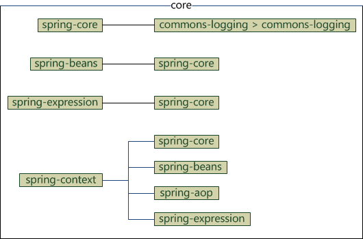
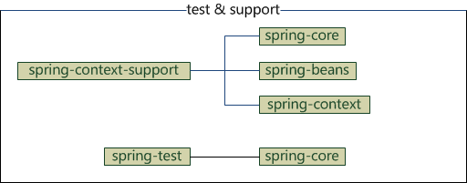

# Spring 笔记

---

## 目录

* [Spring jar 包及 maven 相关](#Spring%20jar%20包及%20maven%20相关) 

---

## 历史及版本

* **Spring 1.0**：发布于 **2004 年 3 月**。首个正式版本，确立了 IoC 容器和 AOP 框架的核心思想。
* **Spring 2.0 / 2.5**：发布于 **2006 年 10 月 / 2007 年 11 月**。引入了可扩展的 XML 配置、支持注解配置以及组件自动扫描。
* **Spring 3.0**：发布于 **2009 年 12 月**。全面支持 Java 5，并引入了强大的 Spring EL 表达式
* **Spring 4.0**：发布于 **2013 年 12 月**。全面支持 [Java 8](../Java_Note.md#JDK8) (包含 Lambda 表达式)，并引入了 WebSocket 支持。 
* **Spring 5.0**：发布于 **2017 年 9 月**。引入了响应式编程模型（Reactive Streams）、核心全面升级支持 [Java 8](../Java_Note.md#JDK8)+，并重构了内部代码。
* **Spring 6.0**：发布于 **2022 年 11 月**。作为里程碑式的版本，全面迈入 [Jakarta EE](../JAVA_EE_Note.md#Jakarta%20EE)（`jakarta.*` 命名空间）并要求最低 [JDK17](../Java_Note.md#JDK17)。
* **Spring 7.0**：最新的主要产品线，当前活跃开发版本，基于 Java 17-25+ 标准和 Jakarta EE 11 构建。

Spring 与 [JDK](../Java_Note.md#java_jdk) 版本大致的对应关系：

* Spring Framework 7.x: JDK 17-25+
* Spring Framework 6.2: JDK 17-25
* Spring Framework 5.3: JDK 8-21

> [!info] 
> 
> 各版本的生命周期可参考：[Spring Framework support](https://spring.io/projects/spring-framework#support)

---

## Spring jar 包及 maven 相关

使用 maven 时，引入 Spring 依赖时，不同的包有其不同的依赖，  这应该注意，以免重复引用。

**Spring Context 包的依赖：**
* spring-core
* spring-beans
* spring-aop
* spring-express

**Spring Context Support 包的依赖：**
* spring-core
* spring-beans
* spring-context

**Spring Beans 包的依赖：**
* spring-core

**Spring Core 包的依赖：**
* spring-jcl

**Spring AOP 包的依赖：**
* spring-core
* spring-beans

**Sping Web 包的依赖：**
* spring-core
* spring-beans

**Spring Web MVC 包的依赖：**
* spring-core
* spring-context
* spring-beans
* spring-aop
* spring-expression
* spring-web

**Spring JDBC 包的依赖：**
* spring-core
* spring-beans
* spring-tx

**Spring TX 包的依赖：**
* spring-core
* spring-beans

从上面的包依赖，可以看出，spring 各组件基础依赖都是 core、beans 和 context，而 **Spring Context** 包又包含了 core 和 beans，所以如果做 Spring 非 web 应用时，只用在 maven 的 pom 文件中添加 **Spring Context** 的包就可以了。  

如果使用 web 就多加个 web 包，如果是使用 **Spring MVC** 框架，那因为 **Spring MVC** 包已经包含了 **Spring Context** 及其依赖包，所以 maven 的 pom 文件只用添加一个 Spring MVC 依赖就可以。

---

## 相关笔记

* [Spring 视频清单](./Spring_Videos.md)
* [Spring 资料清单](Spring_Material.md)

